# goPillion
goPillion is a lightweight, scalable bike ride-sharing application designed to connect riders and passengers in real time. The platform allows users to create ride requests, accept rides nearby, track live locations, and handle secure payments. It focuses on fast matching, low-latency communication, and a simple user experience .
# GoPillion

A high-performance, microservices-based ride-sharing platform specialized for pillion-based transport. Built with real-time rider matching, geospatial routing, and event-driven architecture.

## Architecture

```mermaid
flowchart TB

    %% =========================
    %% CLIENT APPLICATIONS
    %% =========================
    Passenger[📱 Passenger App]
    Driver[🏍️ Driver App]
    Admin[🧑‍💼 Admin Dashboard]

    %% =========================
    %% ENTRY LAYER
    %% =========================
    Nginx[⚡ Nginx]
    APIGW[🔐 API Gateway]

    %% =========================
    %% CORE MICROSERVICES
    %% =========================
    Auth[Auth Service]
    DriverSvc[Driver Service]
    Trip[Trip Service]
    MapSvc[Map Service]
    Notif[Notification Service]
    Msg[Message Service]

    %% =========================
    %% DATABASES (SERVICE-OWNED)
    %% =========================
    PGAuth[(PostgreSQL - Auth DB)]
    PGTrip[(PostgreSQL - Trip DB)]

    MongoDriver[(MongoDB - Driver DB)]
    MongoNotif[(MongoDB - Notification DB)]
    MongoMsg[(MongoDB - Message DB)]

    RedisAuth[(Redis - Auth Cache)]
    RedisDriver[(Redis - Driver Cache)]
    RedisMap[(Redis - Map Cache)]

    %% =========================
    %% EVENT STREAMING
    %% =========================
    KafkaTrip[(Kafka - Trip Events)]
    KafkaMsg[(Kafka - Message Events)]

    %% =========================
    %% PUSH NOTIFICATIONS
    %% =========================
    FCM[(Firebase Cloud Messaging)]

    %% =========================
    %% CLIENT ENTRY FLOW
    %% =========================
    Passenger --> Nginx --> APIGW
    Driver --> Nginx --> APIGW
    Admin --> Nginx --> APIGW

    %% =========================
    %% HTTP REQUEST ROUTING
    %% =========================
    APIGW --> Auth
    APIGW --> DriverSvc
    APIGW --> Trip
    APIGW --> MapSvc

    %% =========================
    %% WEBSOCKET ROUTING
    %% =========================
    APIGW -->|WebSocket| Notif
    APIGW -->|WebSocket| Msg

    %% =========================
    %% DATABASE OWNERSHIP
    %% =========================
    Auth --> PGAuth
    Auth --> RedisAuth

    DriverSvc --> MongoDriver
    DriverSvc --> RedisDriver

    Trip --> PGTrip
    Trip --> KafkaTrip

    MapSvc --> RedisMap

    Notif --> MongoNotif
    KafkaTrip --> Notif

    Msg --> MongoMsg
    Msg --> KafkaMsg

    %% =========================
    %% PUSH FALLBACK FLOW
    %% =========================
    Notif --> FCM

```



## Tech Stack

- **Backend**: Node.js, Express.js
- **Databases**: PostgreSQL 15, MongoDB 7, Redis 7.2
- **Message Broker**: Apache Kafka, Zookeeper
- **Infrastructure**: Docker, Docker Compose, Nginx
- **External Services**: Twilio (SMS), Firebase (Push), Cloudinary (Storage), OSRM (Routing), Nominatim (Geocoding)
- **Real-time**: Socket.io, WebSockets

## Services

### 🔑 Auth Service (Port 3001)
Identity, Security & Session Management

- OTP-based authentication via Twilio
- JWT token generation and validation
- Profile management

### 🚗 Driver Service (Port 3004)
Compliance, Records & Presence

- Driver onboarding and KYC
- Document management (License, RC, Insurance)
- Online/Offline status tracking

### 🚕 Trip Service (Port 3005)
Business Logic & Ride Orchestration

- Ride requests (immediate & scheduled)
- Driver-passenger matching
- OTP-verified trip starts
- Trip state management

### 🗺️ Map Service (Port 3006)
Geospatial Intelligence

- Route optimization via OSRM
- Reverse geocoding via Nominatim
- Distance/duration calculations

### 🔔 Notification Service (Port 3003)
Asynchronous Engagement

- WebSocket notifications
- Firebase push notifications
- Event-driven alerts

### 💬 Message Service (Port 3333)
Real-time Coordination

- Trip-specific chat
- Socket.io messaging
- Message persistence

## Prerequisites

- Docker >= 20.10
- Docker Compose >= 2.0
- Twilio account (SMS)
- Firebase account (Push)
- Cloudinary account (Storage)

## Quick Start

1. **Clone repository**
```bash
git clone <repo-url>
cd gopillion
```

2. **Configure environment**
```bash
cp .env.example .env
# Edit .env with your credentials
```

3. **Start services**
```bash
docker-compose up -d
```

4. **Verify**
```bash
curl http://localhost:8000/health
```

## Environment Variables

```env
# Auth Database
AUTH_DB_HOST=<postgres-host>
AUTH_DB_PORT=5432
AUTH_DB_NAME=auth_db
AUTH_DB_USERNAME=postgres
AUTH_DB_PASSWORD=<password>

# Trip Database
TRIP_DB_HOST=<postgres-host>
TRIP_DB_PORT=5432
TRIP_DB_NAME=trip_db
TRIP_DB_USERNAME=postgres
TRIP_DB_PASSWORD=<password>

# MongoDB
DRIVER_MONGO_URI=mongodb://driver-mongodb:27017/driver_db
NOTIFICATION_MONGO_URI=mongodb://driver-mongodb:27017/notification_db
MESSAGE_MONGO_URI=mongodb://driver-mongodb:27017/message_db

# Security
JWT_SECRET=<secret>
JWT_REFRESH_SECRET=<secret>
ACCESS_TOKEN_EXPIRES_IN=15m
REFRESH_TOKEN_EXPIRES_IN=7d
USERNAME_ADMIN=admin
PASSWORD_ADMIN=<password>

# Twilio
TWILIO_ACCOUNT_SID=<sid>
TWILIO_AUTH_TOKEN=<token>
TWILIO_PHONE_NUMBER=<phone>

# Firebase
FIREBASE_SERVICE_ACCOUNT=<json-credentials>

# Cloudinary
CLOUDINARY_CLOUD=<cloud-name>
CLOUDINARY_KEY=<key>
CLOUDINARY_SECRET=<secret>

# Map Services
OSRM_BASE_URL=http://router.project-osrm.org
NOMINATIM_BASE_URL=https://nominatim.openstreetmap.org

# Kafka & Redis
KAFKA_BROKERS=kafka:9092
REDIS_HOST=redis
REDIS_PORT=6379
```

## API Endpoints

### Authentication
```bash
# Request OTP
POST /auth/request-otp
{"mobile": "+1234567890"}

# Verify OTP
POST /auth/verify-otp
{"mobile": "+1234567890", "otp": "123456"}

# Complete Profile
PATCH /users/profile
Authorization: Bearer <token>
{"name": "John", "email": "john@example.com"}
```

### Driver Operations
```bash
# Register Driver
POST /drivers/register
Authorization: Bearer <token>
{"vehicleType": "bike", "vehicleNumber": "ABC123"}

# Update Status
PATCH /drivers/status
Authorization: Bearer <token>
{"isOnline": true}

# Upload Document
POST /drivers/documents
Authorization: Bearer <token>
Content-Type: multipart/form-data
```

### Trip Operations
```bash
# Request Ride
POST /trips/request
Authorization: Bearer <token>
{
  "pickupLocation": {"latitude": 28.6139, "longitude": 77.2090},
  "dropLocation": {"latitude": 28.5355, "longitude": 77.3910}
}

# Accept Trip
POST /trips/:tripId/accept
Authorization: Bearer <token>

# Start Trip
POST /trips/:tripId/start
Authorization: Bearer <token>
{"otp": "1234"}

# Complete Trip
POST /trips/:tripId/complete
Authorization: Bearer <token>
```

### Map Operations
```bash
# Get Route
POST /maps/route
Authorization: Bearer <token>
{
  "origin": {"latitude": 28.6139, "longitude": 77.2090},
  "destination": {"latitude": 28.5355, "longitude": 77.3910}
}

# Reverse Geocode
GET /maps/reverse-geocode?latitude=28.6139&longitude=77.2090
Authorization: Bearer <token>
```

### Notifications
```bash
# Get Notifications
GET /notifications
Authorization: Bearer <token>

# Mark as Read
PATCH /notifications/:id/read
Authorization: Bearer <token>

# Delete Notification
DELETE /notifications/:id
Authorization: Bearer <token>
```

### Messaging
```bash
# Send Message
POST /messages
Authorization: Bearer <token>
{"tripId": "uuid", "receiverId": "uuid", "text": "Hello"}

# Get Chat History
GET /trips/:tripId/messages
Authorization: Bearer <token>
```

## WebSocket Events

### Notification Service (ws://localhost:3003)
```javascript
const socket = io('ws://localhost:3003', {
  auth: { token: 'jwt-token' }
});

// Events: notification, ride_requested, ride_accepted, 
//         ride_started, ride_completed, driver_nearby
```

### Message Service (ws://localhost:3333)
```javascript
const socket = io('ws://localhost:3333', {
  auth: { token: 'jwt-token' }
});

socket.emit('join-trip', { tripId: 'uuid' });

// Events: new-message, message-sent, typing
```

## Service Ports

- API Gateway: `8000`
- Auth Service: `3001`
- Notification Service: `3003`
- Driver Service: `3004`
- Trip Service: `3005`
- Map Service: `3006`
- Message Service: `3333`
- Redis: `6379`
- MongoDB: `27017`
- Kafka: `9092`
- Zookeeper: `2181`

## Development

```bash
# View logs
docker-compose logs -f

# Restart service
docker-compose restart auth-service

# Stop all
docker-compose down

# Stop and remove volumes
docker-compose down -v
```
