# GoPillion

A high-performance, microservices-based ride-sharing platform specialized for pillion-based transport. Built with real-time rider matching, geospatial routing, and event-driven architecture.

## Architecture

```mermaid
flowchart TB

    %% =========================
    %% CLIENT APPLICATIONS
    %% =========================
    Passenger[📱 Passenger App]
    Driver[🏍️ Driver App]
    Admin[🧑‍💼 Admin Dashboard]

    %% =========================
    %% ENTRY LAYER
    %% =========================
    Nginx[⚡ Nginx]
    APIGW[🔐 API Gateway]

    %% =========================
    %% CORE MICROSERVICES
    %% =========================
    Auth[Auth Service]
    DriverSvc[Driver Service]
    Trip[Trip Service]
    MapSvc[Map Service]
    Notif[Notification Service]
    Msg[Message Service]

    %% =========================
    %% DATABASES (SERVICE-OWNED)
    %% =========================
    PGAuth[(PostgreSQL - Auth DB)]
    PGTrip[(PostgreSQL - Trip DB)]

    MongoDriver[(MongoDB - Driver DB)]
    MongoNotif[(MongoDB - Notification DB)]
    MongoMsg[(MongoDB - Message DB)]

    RedisAuth[(Redis - Auth Cache)]
    RedisDriver[(Redis - Driver Cache)]
    RedisMap[(Redis - Map Cache)]

    %% =========================
    %% EVENT STREAMING
    %% =========================
    KafkaTrip[(Kafka - Trip Events)]
    KafkaMsg[(Kafka - Message Events)]

    %% =========================
    %% PUSH NOTIFICATIONS
    %% =========================
    FCM[(Firebase Cloud Messaging)]

    %% =========================
    %% CLIENT ENTRY FLOW
    %% =========================
    Passenger --> Nginx --> APIGW
    Driver --> Nginx --> APIGW
    Admin --> Nginx --> APIGW

    %% =========================
    %% HTTP REQUEST ROUTING
    %% =========================
    APIGW --> Auth
    APIGW --> DriverSvc
    APIGW --> Trip
    APIGW --> MapSvc

    %% =========================
    %% WEBSOCKET ROUTING
    %% =========================
    APIGW -->|WebSocket| Notif
    APIGW -->|WebSocket| Msg

    %% =========================
    %% DATABASE OWNERSHIP
    %% =========================
    Auth --> PGAuth
    Auth --> RedisAuth

    DriverSvc --> MongoDriver
    DriverSvc --> RedisDriver

    Trip --> PGTrip
    Trip --> KafkaTrip

    MapSvc --> RedisMap

    Notif --> MongoNotif
    KafkaTrip --> Notif

    Msg --> MongoMsg
    Msg --> KafkaMsg

    %% =========================
    %% PUSH FALLBACK FLOW
    %% =========================
    Notif --> FCM

```



## Tech Stack

- **Backend**: Node.js, Express.js
- **Databases**: PostgreSQL 15, MongoDB 7, Redis 7.2
- **Message Broker**: Apache Kafka, Zookeeper
- **Infrastructure**: Docker, Docker Compose, Nginx
- **External Services**: Twilio (SMS), Firebase (Push), Cloudinary (Storage), OSRM (Routing), Nominatim (Geocoding)
- **Real-time**: Socket.io, WebSockets

## Services

###  Auth Service (Port 3001)
Identity, Security & Session Management

- OTP-based authentication via Twilio
- JWT token generation and validation
- Profile management

###  Driver Service (Port 3004)
Compliance, Records & Presence

- Driver onboarding and KYC
- Document management (License, RC, Insurance)
- Online/Offline status tracking

###  Trip Service (Port 3005)
Business Logic & Ride Orchestration

- Ride requests (immediate & scheduled)
- Driver-passenger matching
- OTP-verified trip starts
- Trip state management

###  Map Service (Port 3006)
Geospatial Intelligence

- Route optimization via OSRM
- Reverse geocoding via Nominatim
- Distance/duration calculations

###  Notification Service (Port 3003)
Asynchronous Engagement

- WebSocket notifications
- Firebase push notifications
- Event-driven alerts

###  Message Service (Port 3333)
Real-time Coordination

- Trip-specific chat
- Socket.io messaging
- Message persistence

## API Documentation

- 📬 **Postman Collection & API Reference**  
  https://documenter.getpostman.com/view/21537931/2sBXcBnhef


## Prerequisites

- Docker >= 20.10
- Docker Compose >= 2.0
- Twilio account (SMS)
- Firebase account (Push)
- Cloudinary account (Storage)

## Quick Start

1. **Clone repository**
```bash
git clone https://github.com/Ashif2409/goPillion.git
cd goPillion
```

2. **Start services**
```bash
docker-compose up -d
```

3. **Verify**
```bash
curl http://localhost:8000/
```

## Environment Variables

```env
# Auth Database
AUTH_DB_HOST=<postgres-host>
AUTH_DB_PORT=5432
AUTH_DB_NAME=auth_db
AUTH_DB_USERNAME=postgres
AUTH_DB_PASSWORD=<password>

# Trip Database
TRIP_DB_HOST=<postgres-host>
TRIP_DB_PORT=5432
TRIP_DB_NAME=trip_db
TRIP_DB_USERNAME=postgres
TRIP_DB_PASSWORD=<password>

# MongoDB
DRIVER_MONGO_URI=mongodb://driver-mongodb:27017/driver_db
NOTIFICATION_MONGO_URI=mongodb://driver-mongodb:27017/notification_db
MESSAGE_MONGO_URI=mongodb://driver-mongodb:27017/message_db

# Security
JWT_SECRET=<secret>
JWT_REFRESH_SECRET=<secret>
ACCESS_TOKEN_EXPIRES_IN=15m
REFRESH_TOKEN_EXPIRES_IN=7d
USERNAME_ADMIN=admin
PASSWORD_ADMIN=<password>

# Twilio
TWILIO_ACCOUNT_SID=<sid>
TWILIO_AUTH_TOKEN=<token>
TWILIO_PHONE_NUMBER=<phone>

# Firebase
FIREBASE_SERVICE_ACCOUNT=<json-credentials>

# Cloudinary
CLOUDINARY_CLOUD=<cloud-name>
CLOUDINARY_KEY=<key>
CLOUDINARY_SECRET=<secret>

# Map Services
OSRM_BASE_URL=http://router.project-osrm.org
NOMINATIM_BASE_URL=https://nominatim.openstreetmap.org

# Kafka & Redis
KAFKA_BROKERS=kafka:9092
REDIS_HOST=redis
REDIS_PORT=6379
```


## Service Ports

- API Gateway: `8000`
- Auth Service: `3001`
- Notification Service: `3003`
- Driver Service: `3004`
- Trip Service: `3005`
- Map Service: `3006`
- Message Service: `3333`
- Redis: `6379`
- MongoDB: `27017`
- Kafka: `9092`
- Zookeeper: `2181`

## Development

```bash
# View logs
docker-compose logs -f

# Restart service
docker-compose restart auth-service

# Stop all
docker-compose down

# Stop and remove volumes
docker-compose down -v
```
